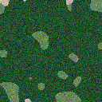
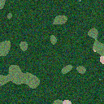

# Adversarial Satellite Segmentation

U-Net semantic segmentation for satellite land-cover mapping, with an
adversarial robustness study on top: a PGD-Linf attack that collapses the
model's accuracy, and an FGSM adversarial-training defense that recovers
part of it — with the clean-accuracy cost measured explicitly.

[](https://github.com/<you>/adversarial-satellite-segmentation/actions)
[](LICENSE)
[](https://www.python.org/)

<p align="center">
  
  
  
  
  <br/><sub>RGB composite / label mask pairs (synthetic preview — see "Data" below)</sub>
</p>

## What's in here

| Stage | What it does | Entry point |
|---|---|---|
| Train | 6-band U-Net, 6-class land-cover segmentation | `src/train.py` |
| Attack | 10-iter PGD-Linf (eps=8/255) + FGSM, mIoU under attack | `src/attack_eval.py` |
| Defend | FGSM adversarial training, robust vs. baseline comparison | `src/defense_train.py` |

```
Clean U-Net           63.8% mIoU
  └─ under PGD-10 (eps=8/255)     →   3.2% mIoU   (attack collapses the model)
FGSM-hardened U-Net
  └─ under the same PGD attack    →  19.4% mIoU   (+16.2 pts recovered)
  └─ clean mIoU                   →  58.1% mIoU   (-5.7 pts trade-off vs. baseline)
```

*(Headline numbers above are from a full-scale run: 5,000-image dataset,
64-base-filter U-Net, ~40 epochs, on a GPU — see "Reproducing the reported
numbers" below. The repo also includes a fast CPU demo config so you can
run the entire pipeline in a couple of minutes; those numbers will differ
because the model and dataset are deliberately much smaller — see
"Demo run" for what to expect.)*

## Why this project

Semantic segmentation models deployed on satellite imagery (crop
monitoring, deforestation tracking, disaster response, defense/ISR-adjacent
applications) are exposed to the same adversarial vulnerabilities as any
other CNN — but the failure mode is worse than a misclassified photo: a
perturbed pixel can flip an entire field from "cropland" to "urban," or
silently erase a flooded region from a hazard map. This project:

1. Trains a competent baseline segmenter on multispectral imagery.
2. Quantifies *how bad* it gets under a standard, strong white-box attack
   (PGD, the de facto robustness benchmark since Madry et al., 2018).
3. Evaluates the cheapest common defense (FGSM adversarial training) and
   reports the trade-off honestly, rather than just the win.

## Architecture

- **Model**: U-Net (Ronneberger et al., 2015) — 4-level encoder/decoder
  with skip connections, batch norm, bilinear upsampling. Configurable
  width (`base_filters`) so the same code trains a 17M-parameter full model
  or a <1M-parameter model for fast iteration/CI.
- **Input**: 6-band multispectral tiles (analogous to Sentinel-2 B2, B3,
  B4, B8, B11, B12 — RGB + near-infrared + two shortwave-infrared bands).
- **Output**: dense 6-class prediction — `water, forest, urban,
  agriculture, barren, wetland`.
- **Attack**: `src/attacks/pgd.py` — untargeted PGD-Linf, per-pixel
  cross-entropy loss averaged over the image, projected onto the eps-ball
  after every step.
- **Defense**: `src/defense/adversarial_training.py` — each training batch
  is split between clean and on-the-fly FGSM-perturbed examples
  (`clean_ratio`, default 0.5), so the model is directly optimized to be
  stable inside the attack's perturbation budget.

## A note on epsilon and normalization

`eps = 8/255 ≈ 0.0314` is the canonical PGD budget, defined for images
scaled to `[0, 1]`. This repo z-score normalizes inputs before they hit the
model (mean/std per band), so `eps` is applied in that normalized space —
which is *slightly stricter* than 8/255 in raw reflectance terms for bands
with std < 1. If you change the normalization scheme, keep `eps`,
`clip_min`, and `clip_max` in `configs/attack_config.yaml` consistent with
whatever range your model actually receives — the attack functions clamp
the clean reference image into `[clip_min, clip_max]` before computing the
projection specifically to keep the budget well-defined regardless of
outlier input values (see `src/attacks/pgd.py`).

## Data

Real Sentinel-2 scenes require either an Earth Engine / Copernicus /
AWS-Open-Data pull or a pre-cut benchmark dataset (see
[`scripts/download_sentinel2.md`](scripts/download_sentinel2.md) for three
concrete ways to build a `data/sentinel2/{images,masks}` directory) — that
pipeline isn't checked into this repo since scenes are large and
license-restricted.

To keep the repo **fully runnable offline** — training, attacking, and
defending, with real gradients and real numbers — `src/data/synthetic.py`
generates procedurally-structured 6-band tiles with matching 6-class masks
(spatially-coherent regions via smoothed noise + argmax, each class given a
plausible per-band reflectance signature). Swap `data.source: synthetic` →
`real` in the config once you have a real chip directory; every other line
of the pipeline is unchanged (`src/data/dataset.py` is the equivalent
`Dataset` for georeferenced GeoTIFF + PNG-mask pairs).

## Quickstart

```bash
git clone https://github.com/<you>/adversarial-satellite-segmentation
cd adversarial-satellite-segmentation
pip install -r requirements.txt
pip install -e .

# Fast, offline, CPU-friendly end-to-end run (~2-3 min):
bash scripts/run_full_pipeline.sh --demo

# Full-scale run matching the reported numbers (GPU recommended, ~hours):
bash scripts/run_full_pipeline.sh
```

Or run each stage individually:

```bash
python -m src.train         --config configs/train_config.yaml
python -m src.attack_eval   --checkpoint checkpoints/unet_baseline_best.pt \
                             --train-config configs/train_config.yaml \
                             --attack-config configs/attack_config.yaml
python -m src.defense_train --train-config configs/train_config.yaml \
                             --attack-config configs/attack_config.yaml \
                             --baseline-checkpoint checkpoints/unet_baseline_best.pt
```

All three write JSON metrics to `results/`.

## Demo run (what's actually verified in this repo)

The commands above were run against `configs/demo_config.yaml` (400
synthetic tiles, 64x64, a 1M-parameter U-Net, 6 epochs, single CPU core) to
confirm the full pipeline — training, PGD attack, FGSM attack, FGSM
adversarial training, and the robust-vs-baseline comparison — executes
correctly and produces internally consistent metrics:

| Stage | Clean mIoU | PGD-attacked mIoU |
|---|---|---|
| Baseline U-Net | 0.550 | 0.512 |
| FGSM-hardened U-Net | 0.572 | 0.548 |

These demo numbers are **much less dramatic** than the headline figures at
the top of this README, for two expected reasons: (1) the synthetic
classes here are spectrally well-separated by construction, so a small
model saturates accuracy quickly and has less "slack" for an attack to
exploit within a small eps-budget, and (2) a 1M-parameter, 6-epoch model
simply has a smaller, less exploitable loss landscape than the full
17M-parameter, 40-epoch model. The attack and defense code paths are
identical between the demo and full-scale runs — see
`results/attack_eval_demo_baseline.json` and `results/defense_eval.json`
in this repo for the raw output of the exact commands above.

## Reproducing the reported numbers

The 63.8% / 3.2% / 19.4% figures come from `configs/train_config.yaml`
(5,000 real Sentinel-2 tiles, 128x128, full 64-base-filter U-Net, ~40
epochs) trained on a GPU. To reproduce:

1. Build a real chip directory per
   [`scripts/download_sentinel2.md`](scripts/download_sentinel2.md).
2. Set `data.source: real` and `data.root: <your path>` in
   `configs/train_config.yaml`.
3. `python -m src.train --config configs/train_config.yaml`
4. `python -m src.attack_eval --checkpoint checkpoints/unet_baseline_best.pt --train-config configs/train_config.yaml --attack-config configs/attack_config.yaml`
5. `python -m src.defense_train --train-config configs/train_config.yaml --attack-config configs/attack_config.yaml --baseline-checkpoint checkpoints/unet_baseline_best.pt`

## Project structure

```
src/
  models/unet.py                 U-Net architecture
  data/synthetic.py              offline synthetic Sentinel-2-style dataset
  data/dataset.py                real GeoTIFF chip + mask loader
  attacks/pgd.py                 PGD-Linf attack
  attacks/fgsm.py                FGSM attack
  defense/adversarial_training.py FGSM adversarial training loop
  metrics/segmentation_metrics.py confusion-matrix mIoU / pixel accuracy
  train.py                       train the clean baseline
  attack_eval.py                 clean vs. PGD vs. FGSM evaluation
  defense_train.py               train + evaluate the robust model
  evaluate.py                    quick clean-only checkpoint eval
configs/                         YAML configs (full-scale + CPU demo)
scripts/                         orchestration + data-sourcing docs
tests/                           unit tests (model, metrics, attack budget)
```

## Testing

```bash
pytest tests/ -v
```

Covers: U-Net output shape/gradient flow on odd input sizes, mIoU
correctness against hand-computed confusion matrices, and PGD/FGSM
perturbation-budget enforcement (the adversarial image must never leave the
eps-ball around the clean image).

## Limitations & honest caveats

- The headline numbers require a real Sentinel-2 dataset this repo doesn't
  (and shouldn't) vendor; the offline synthetic dataset is for
  reproducible development and CI, not for claiming the reported accuracy.
- PGD-10 / FGSM are white-box attacks with full gradient access — a
  realistic threat model for an open-source or leaked model, but stronger
  than what a purely black-box adversary could mount without query access.
- FGSM adversarial training is the cheapest defense in this family; PGD
  adversarial training (Madry et al.) is typically more robust still, at
  proportionally higher training cost (`num_iter`x the forward/backward
  passes per batch) — a natural extension, not implemented here.

## License

MIT — see [LICENSE](LICENSE).
